# LAIR Image Generator Setup with ComfyUI

## Before you start

It is recommended to install ComfyUI on a machine equipped with a GPU. A gaming GPU with 6 GB of VRAM can also be used, although having more available VRAM allows you to choose from a wider range of models. For an example setup using Qwen Image for image generation and editing, see the [Open WebUI instructions](https://docs.openwebui.com/features/chat-conversations/image-generation-and-editing/comfyui#example-setup-qwen-image-generation-and-editing).

To set up a generator in LAIR, you need to create and export a flow in ComfyUI.

## 1. ComfyUI Settings

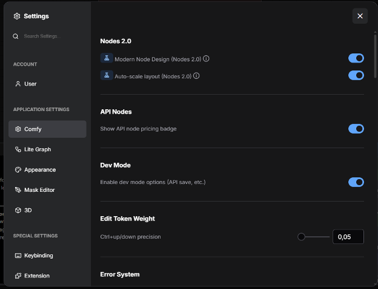

1. Access **ComfyUI** and click the **Settings** icon from the bottom-left sidebar.
2. From the popup that appears, click the **Comfy** entry on the left and enable the **Dev Mode** option.
3. From the left menu, select **Lite Graph**, search for the **Node ID badge mode** option, and set it to **Show all**.
4. Close the popup.

---

## 2. Extension Installation

1. From the sidebar, click the ComfyUI logo and select **Extensions**.
2. From the window that opens, type `Comfy Asset Downloader` in the search bar.

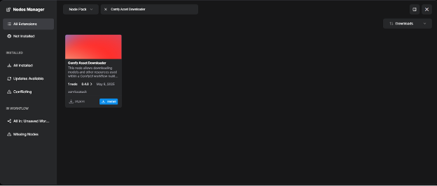

3. Once the extension is installed, restart ComfyUI by clicking the **Apply Changes** button.

---

## 3. Import a Template

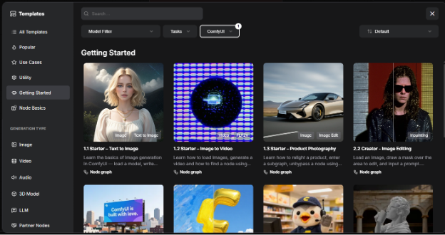

1. From the sidebar, click the **Templates** icon.
2. From the window that opens, click the **Getting Started** entry in the left menu and select the **1.1 Starter - Text to Image** template.

---

## 4. Install Missing Model

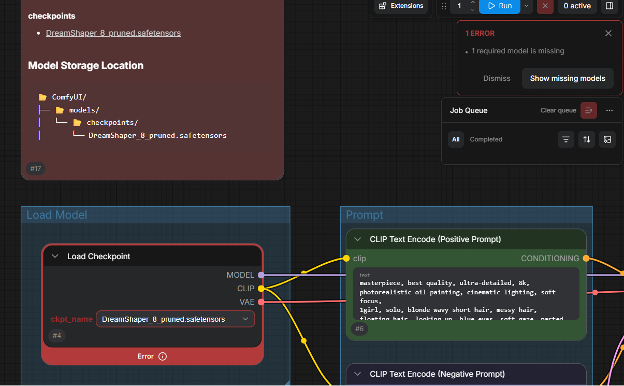

1. Once the template is imported, ComfyUI indicates that the `DreamShaper_8_pruned` model is missing. Click the **Show missing models** button and from the section that opens, click **Copy URL**.
2. Modify the model URL:
   * **Original:** `https://huggingface.co/Lykon/DreamShaper/blob/main/DreamShaper_8_pruned.safetensors`
   * **Modified:** `https://huggingface.co/Lykon/DreamShaper/resolve/main/DreamShaper_8_pruned.safetensors` *(replace "blob" with "resolve")*
3. From the sidebar, click **Nodes** and type `Required Asset` in the search bar. Drag the **Required Asset** node under the EXTENSIONS text on the canvas.

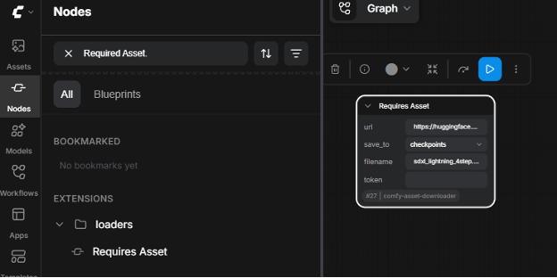

4. Insert the modified model link in the **URL** field, and the model name `DreamShaper_8_pruned.safetensors` in the **filename** field.
5. Click **Run** at the top right to download the model.
6. Once the download is finished, reload ComfyUI by refreshing the page. Once the page is reloaded, the missing model error will no longer be shown.
7. Click the **Run** button to test image generation.

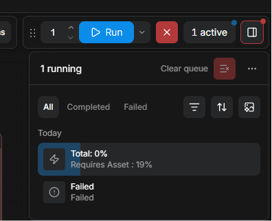

8. Delete the **Required Asset** node by right-clicking on it and selecting **Remove**. 
9. Click the ComfyUI button, select **File > Export (API)**, and save it to your computer.

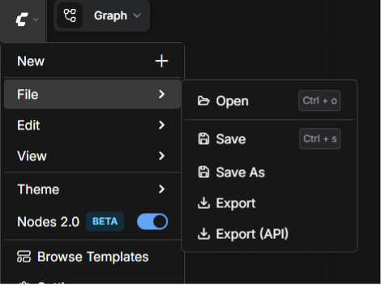

---

## 5. Setting up the Image Generator on LAIR

1. Access LAIR and select **Admin Panel** by clicking your name in the bottom-left corner.

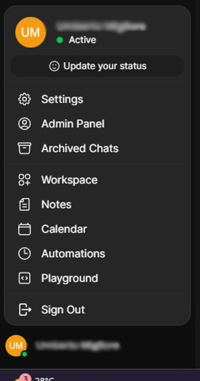

2. Select the **Settings** entry at the top, and in the **Images** side menu, enter the following values:
   * **Image Generation Engine:** ComfyUI
   * **ComfyUI Base URL:** `http://<ComfyUI_IP_address>:8188`
   * **ComfyUI Workflow:** Upload the file exported from ComfyUI

3. Finally, populate the following entries for the uploaded workflow by entering the node ID number for each (visible at the bottom left of the nodes in ComfyUI):

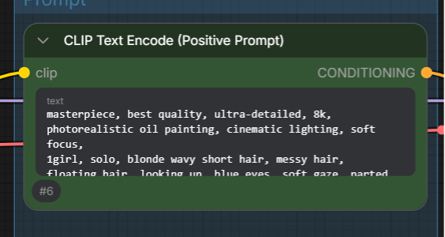

   * **text:** `6`
   * **ckpt_name:** `4`
   * **width:** `5`
   * **height:** `5`
   * **steps:** `3`
   * **seed:** `3`

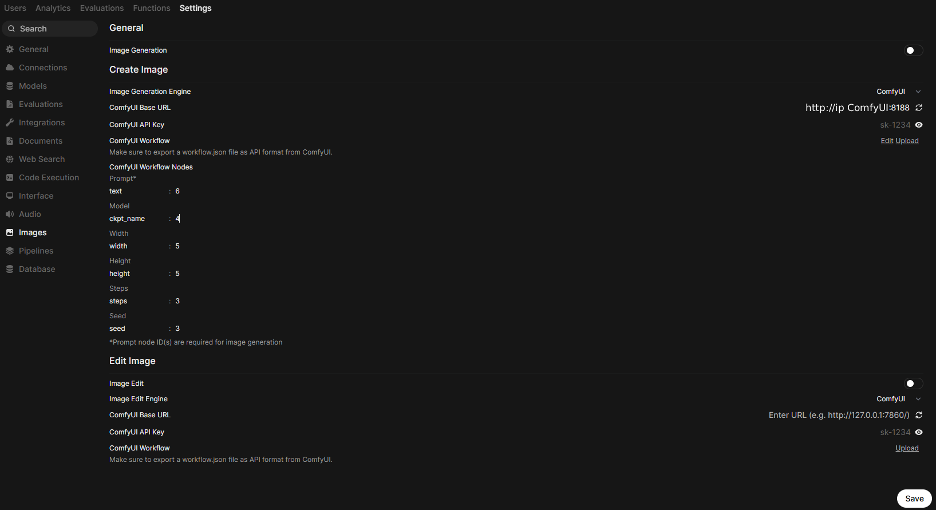

4. Enable the **Image Generation** entry and click the **Save** button.
5. Open a new chat, activate **Image support**, enter a prompt, and generate an image!

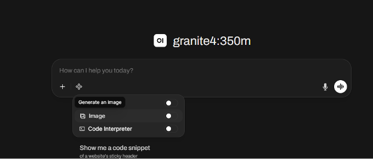
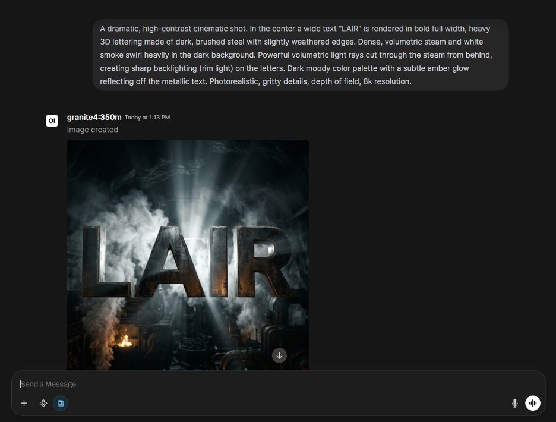
