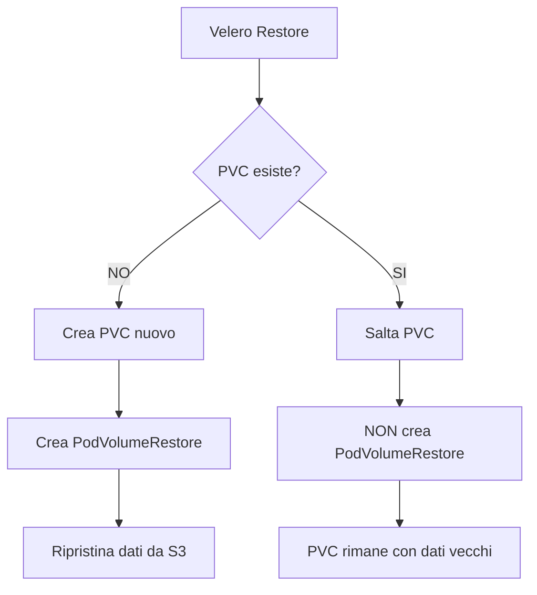

# 🔄 Guida al Restore di Velero

## 📋 Indice

- [Comportamento di Velero con PVC Esistenti](#comportamento-di-velero-con-pvc-esistenti)
- [Scenari di Restore](#scenari-di-restore)
  - [Scenario 1: Cluster Nuovo (Disaster Recovery)](#scenario-1-cluster-nuovo-disaster-recovery-completo-)
  - [Scenario 2: Cluster Esistente (Test Restore)](#scenario-2-cluster-esistente-con-dati-test-restore-)
  - [Scenario 3: Restore Senza Cleanup](#scenario-3-restore-senza-cleanup-quello-che-hai-fatto-)
  - [Scenario 4: Restore su Namespace Diverso](#scenario-4-restore-su-namespace-diverso-test-sicuro-)
- [Procedura Corretta](#procedura-corretta)
- [Troubleshooting](#troubleshooting)

---

## 🎯 Comportamento di Velero con PVC Esistenti

### ⚠️ IMPORTANTE: Velero NON sovrascrive PVC esistenti

Quando esegui un restore di Velero:

| Risorsa | Se già esiste | Comportamento Velero |
|---------|---------------|----------------------|
| **Deployment** | ✅ Esiste | ⚠️ Crea con nome diverso o salta |
| **Service** | ✅ Esiste | ⚠️ Genera warning, salta |
| **ConfigMap** | ✅ Esiste | ⚠️ Salta |
| **PVC** | ✅ Esiste | ❌ **SALTA COMPLETAMENTE** |
| **Volume Data** | PVC esiste | ❌ **NON RIPRISTINA I DATI** |

### 🔍 Cosa Succede Durante il Restore



**Risultato:**
- Se **PVC esistevano prima** del restore: ✅ Struttura OK, ❌ **Dati NON ripristinati**
- Se **PVC NON esistevano**: ✅ Struttura OK, ✅ **Dati ripristinati**

---

## 📚 Scenari di Restore

### Scenario 1: Cluster Nuovo (Disaster Recovery Completo) ✅

**Situazione:** Cluster completamente distrutto, nuovo cluster vuoto

```bash
# Su nuovo cluster con Velero installato
cd /path/to/lair/helm-chart
./disaster-recovery-restore.sh lair-backup-20251010-020039
```

**Risultato:**
- ✅ Tutti i PVC vengono creati
- ✅ PodVolumeRestores vengono creati (5 nel tuo caso)
- ✅ **Dati completamente ripristinati** (~1.7GB)
- ✅ Ollama models, PostgreSQL DB, tutto ripristinato

### Scenario 2: Cluster Esistente con Dati (Test Restore) ⚠️

**Situazione:** Cluster attivo, vuoi testare il restore o rollback

```bash
# OPZIONE A: Con cleanup automatico (RACCOMANDATO)
cd /path/to/lair/helm-chart
./disaster-recovery-restore.sh --clean-restore lair-backup-20251010-020039
# Questo script:
# 1. Scala deployment a 0
# 2. Cancella PVC esistenti
# 3. Esegue restore completo con dati
# 4. Scala deployment a dimensioni originali

# OPZIONE B: Cleanup manuale
kubectl scale deployment -n lair --all --replicas=0
kubectl scale statefulset -n lair --all --replicas=0
kubectl delete pvc -n lair --all
# Aspetta che i PVC siano cancellati
kubectl get pvc -n lair  # deve mostrare "No resources found"

# Poi esegui restore
./disaster-recovery-restore.sh lair-backup-20251010-020039
```

**Risultato:**
- ✅ PVC vengono cancellati e ricreati
- ✅ PodVolumeRestores vengono creati
- ✅ **Dati ripristinati da backup**

### Scenario 3: Restore Senza Cleanup (Quello che hai fatto) ⚠️

**Situazione:** Hai eseguito restore su cluster con PVC esistenti

```bash
./disaster-recovery-restore.sh lair-backup-20251010-020039
# Rispondi "no" alla domanda di cleanup
```

**Risultato:**
```
━━━━━━━━━━━━━━━━━━━━━━━━━━━━━━━━━━━━━━━━
💾 Verifying Volume Data Restoration
━━━━━━━━━━━━━━━━━━━━━━━━━━━━━━━━━━━━━━━━

[WARN] ⚠️  No PodVolumeRestores found!
[WARN] This means volume DATA was NOT restored!

Most common cause: PVCs already existed before restore
➜ Velero skips existing PVCs and does not restore data into them
```

- ✅ Risorse Kubernetes ripristinate (Deployments, Services, etc.)
- ✅ PVC esistono (ma con struttura vecchia)
- ❌ **Dati NON ripristinati** (rimangono i dati vecchi nei PVC)
- ❌ 0 PodVolumeRestores creati

### Scenario 4: Restore su Namespace Diverso (Test Sicuro) ✅

**Situazione:** Vuoi testare il restore o clonare l'ambiente senza toccare la produzione

```bash
# Restore in namespace diverso usando namespace mapping di Velero
cd /path/to/lair/helm-chart
./disaster-recovery-restore.sh --to-namespace lair-test lair-backup-20251010-020039
```

**Risultato:**
- ✅ Namespace `lair-test` creato automaticamente
- ✅ Tutte le risorse ripristinate in `lair-test` (NON in `lair`)
- ✅ 5 PodVolumeRestores creati (~1.7GB dati)
- ✅ PVC nuovi con dati completi
- ✅ **Dati completamente ripristinati**
- ✅ Produzione (`lair`) completamente intoccata

**Output atteso:**
```
[INFO] Creating restore: lair-restore-20251010-200434
[INFO] From backup: lair-backup-20251010-020039
[INFO] Target namespace: lair-test (mapped from: lair)
[INFO] Creating namespace: lair-test
namespace/lair-test created
[OK] Namespace created

━━━━━━━━━━━━━━━━━━━━━━━━━━━━━━━━━━━━━━━━
💾 Verifying Volume Data Restoration
━━━━━━━━━━━━━━━━━━━━━━━━━━━━━━━━━━━━━━━━

[OK] Found 5 PodVolumeRestore(s)
[OK] All 5 PodVolumeRestores completed successfully!
[OK] ✅ Volume data has been restored

Kubernetes Resources:
  ✅ Pods: 6/6 running
  ✅ PVCs: 5/5 bound
  ✅ Services: 6 created

Volume Data Restoration:
  ✅ PodVolumeRestores: 5/5 completed
  ✅ Volume data: RESTORED
```

**Casi d'uso:**

1. **Test Restore Prima di Applicare in Produzione**
   ```bash
   # Test restore in namespace separato
   ./disaster-recovery-restore.sh --to-namespace lair-test backup-name
   
   # Verifica che tutto sia OK
   kubectl get pods -n lair-test
   kubectl exec -n lair-test ollama-0 -- ls /root/.ollama/models
   
   # Se OK, cancella il test e applica in produzione
   kubectl delete namespace lair-test
   ./disaster-recovery-restore.sh --clean-restore backup-name
   ```

2. **Clone Produzione per Sviluppo/Testing**
   ```bash
   # Crea clone completo di produzione
   ./disaster-recovery-restore.sh --to-namespace lair-dev latest-backup
   
   # Ora hai due ambienti indipendenti:
   # - lair (produzione, intoccata)
   # - lair-dev (clone per test)
   
   # Modifica lair-dev senza rischi
   kubectl exec -n lair-dev ...
   ```

3. **Confronta Backup con Dati Attuali**
   ```bash
   # Ripristina vecchio backup in namespace separato
   ./disaster-recovery-restore.sh --to-namespace lair-compare old-backup
   
   # Confronta dati
   kubectl exec -n lair postgres-0 -- pg_dump db > current.sql
   kubectl exec -n lair-compare postgres-0 -- pg_dump db > backup.sql
   diff current.sql backup.sql
   ```

4. **Recupero Dati Specifici**
   ```bash
   # Ripristina backup in namespace temporaneo
   ./disaster-recovery-restore.sh --to-namespace lair-recovery backup-name
   
   # Copia solo i dati che ti servono
   kubectl cp lair-recovery/pod:/path/to/data ./recovered-data
   
   # Cleanup
   kubectl delete namespace lair-recovery
   ```

**Vantaggi:**
- ✅ Zero rischio per produzione
- ✅ Test completo del restore
- ✅ Verifica integrità dati
- ✅ Confronto versioni
- ✅ Recovery selettivo
- ✅ Ambienti multipli sullo stesso cluster

**Nota:** Dopo il test, ricorda di cancellare il namespace:
```bash
kubectl delete namespace lair-test
```

---

## 🛠️ Procedura Corretta per Disaster Recovery

### Step 1: Verifica Prerequisiti

```bash
# 1. Velero installato e configurato
kubectl get pods -n velero
# Deve mostrare: velero pod RUNNING + node-agent pods RUNNING

# 2. BackupStorageLocation disponibile
kubectl get backupstoragelocation -n velero
# Deve mostrare: default   Available

# 3. Lista backup disponibili
cd /path/to/lair/helm-chart
./disaster-recovery-restore.sh --list-backups
```

### Step 2: Decidi lo Scenario

#### Per Disaster Recovery Completo (Cluster Nuovo)

```bash
# Installa Velero sul nuovo cluster con stessa configurazione S3
# poi:
./disaster-recovery-restore.sh <nome-backup>
```

#### Per Rollback su Cluster Esistente

```bash
# RACCOMANDATO: Usa --clean-restore
./disaster-recovery-restore.sh --clean-restore <nome-backup>

# Questo script automaticamente:
# 1. Ferma tutti i pod
# 2. Cancella PVC
# 3. Ripristina tutto
# 4. Riavvia i pod
```

### Step 3: Verifica Ripristino

```bash
# 1. Verifica PodVolumeRestores (DEVE mostrare 5 nel tuo caso)
kubectl get podvolumerestores -n velero | grep <restore-name>

# Output atteso:
# <restore-name>-xxxxx   Completed   ...   (5 righe)

# 2. Verifica dimensioni PVC (devono avere dati)
kubectl get pvc -n lair

# 3. Verifica pods sono running
kubectl get pods -n lair

# 4. Verifica dati applicazione (esempio: Ollama models)
kubectl exec -n lair ollama-0 -- ls -lh /root/.ollama/models
# Deve mostrare i tuoi modelli
```

---

## 🔍 Troubleshooting

### ❌ Problema: 0 PodVolumeRestores dopo restore

**Sintomo:**
```
[WARN] ⚠️  No PodVolumeRestores found!
[WARN] This means volume DATA was NOT restored!
```

**Causa:** PVC già esistevano prima del restore

**Soluzione:**
```bash
# Opzione 1: Usa --clean-restore
./disaster-recovery-restore.sh --clean-restore <backup-name>

# Opzione 2: Cleanup manuale
kubectl scale deployment -n lair --all --replicas=0
kubectl scale statefulset -n lair --all --replicas=0
kubectl delete pvc -n lair --all
# Aspetta cancellazione completa
watch kubectl get pvc -n lair
# Quando mostra "No resources found", esegui:
./disaster-recovery-restore.sh <backup-name>
```

### ❌ Problema: Restore completa ma con warnings

**Sintomo:**
```
[WARN] Restore completed with 17 warning(s)
```

**Causa:** Risorse già esistevano (normale se cluster non è vuoto)

**Verifica:**
```bash
# Controlla se i PodVolumeRestores sono stati creati
kubectl get podvolumerestores -n velero | grep <restore-name>

# Se vedi 5 PodVolumeRestores: ✅ Dati ripristinati
# Se vedi 0 PodVolumeRestores: ❌ Dati NON ripristinati
```

### ❌ Problema: node-agent non trovato

**Sintomo:**
```
[ERROR] ❌ CRITICAL: node-agent DaemonSet not found!
```

**Causa:** Velero installato senza `deployNodeAgent: true`

**Soluzione:**
```bash
# Aggiorna Velero per abilitare node-agent
helm upgrade velero vmware-tanzu/velero -n velero \
  --set configuration.defaultVolumesToFsBackup=true \
  --set deployNodeAgent=true \
  --reuse-values

# Verifica node-agent sia running
kubectl get daemonset node-agent -n velero
kubectl get pods -n velero | grep node-agent
```

---

## 📊 Verifica Backup Prima del Restore

Prima di eseguire un restore, verifica che il backup contenga effettivamente i dati:

```bash
# 1. Verifica stato backup
kubectl get backups.velero.io <backup-name> -n velero

# 2. Verifica PodVolumeBackups (dati dei volumi)
kubectl get podvolumebackups -n velero | grep <backup-name>

# Output atteso per backup completo:
# <backup-name>-xxxxx   Completed   ...   1723799394   (bytes backed up)
# ... (5 righe per Lair completo)

# 3. Verifica dimensione backup
kubectl describe backups.velero.io <backup-name> -n velero | grep "Items Backed Up"
# Deve mostrare ~56 items per Lair completo
```

---

## 🎯 Best Practices

### ✅ DO (Fai)

1. **Testa il restore periodicamente** su un cluster di test
2. **Usa `--clean-restore`** quando fai restore su cluster esistente
3. **Verifica sempre** che `PodVolumeRestores` siano stati creati
4. **Mantieni node-agent sempre attivo** (verifica con `kubectl get daemonset -n velero`)
5. **Documenta i backup** prima di fare restore (quali dati contengono)

### ❌ DON'T (Non fare)

1. ❌ **NON fare restore senza verificare** che node-agent sia running
2. ❌ **NON aspettarti che Velero sovrascriva PVC esistenti** (non lo fa!)
3. ❌ **NON ignorare** i warning di 0 PodVolumeRestores (significa dati non ripristinati)
4. ❌ **NON cancellare manualmente PVC** se non hai fermato prima i pod
5. ❌ **NON fare restore in produzione** senza prima testare su ambiente di test

---

## 📝 Riepilogo del Tuo Caso

### Cosa è successo nel tuo test

```bash
# Hai eseguito:
./disaster-recovery-restore.sh lair-full-backup-20251010-180052
# Risposto "no" alla domanda di cleanup

# Risultato:
- ✅ Velero ha ripristinato Deployments, Services, ConfigMaps
- ✅ Velero ha visto che PVC già esistevano
- ⚠️ Velero ha SALTATO i PVC esistenti (comportamento corretto!)
- ❌ 0 PodVolumeRestores creati → dati NON ripristinati
- ✅ Applicazioni continuano a funzionare con dati esistenti
```

### Come fare un vero restore con dati

```bash
# Opzione 1: Automatico (RACCOMANDATO)
./disaster-recovery-restore.sh --clean-restore lair-full-backup-20251010-180052

# Opzione 2: Manuale
kubectl scale deployment -n lair --all --replicas=0
kubectl scale statefulset -n lair --all --replicas=0
kubectl delete pvc -n lair --all
# Aspetta cancellazione
./disaster-recovery-restore.sh lair-full-backup-20251010-180052

# Verifica successo (DEVE mostrare 5 PodVolumeRestores):
kubectl get podvolumerestores -n velero | grep lair-restore
```

---

## 🚀 Scenario Disaster Recovery Completo

Questo è lo scenario per cui Velero è stato progettato:

### Giorno 1: Tutto funziona

```bash
# Sistema in produzione
kubectl get pods -n lair  # tutto RUNNING
# Backup automatici ogni notte alle 02:00
```

### Giorno 2: DISASTRO! 💥

```bash
# Server si rompe, disco si guasta, cluster inaccessibile
# Tutto perso
```

### Giorno 3: Ripristino

```bash
# 1. Nuovo server/cluster
# 2. Installa MicroK8s
cd /path/to/lair/microk8s
./setup.sh --enable-velero
# (usa STESSE credenziali S3 del cluster vecchio!)

# 3. Verifica backup disponibili
kubectl get backups.velero.io -n velero
# Vede tutti i backup del cluster vecchio! ✅

# 4. Ripristina ultimo backup
cd /path/to/lair/helm-chart
./disaster-recovery-restore.sh lair-backup-20251002-020022

# 5. Risultato:
# ✅ Tutti i PVC creati (erano vuoti)
# ✅ 5 PodVolumeRestores creati
# ✅ ~1.7GB di dati ripristinati da S3
# ✅ Ollama models: OK
# ✅ PostgreSQL databases: OK
# ✅ OpenWebUI data: OK
# ✅ Sistema completamente ripristinato!
```

**Tempo totale:** ~20-30 minuti (dipende dalla dimensione backup)

---

## 📞 Supporto

Per problemi o domande:

1. **Verifica log dettagliati:**
   ```bash
   kubectl logs -n velero deployment/velero --tail=200
   kubectl logs -n velero daemonset/node-agent --tail=200
   ```

2. **Esporta restore details:**
   ```bash
   kubectl describe restore <restore-name> -n velero > restore-details.txt
   kubectl get podvolumerestores -n velero | grep <restore-name> > pvr-status.txt
   ```

3. **Contatta il team** con i file sopra allegati

---

**Ricorda:** Il comportamento che hai osservato (0 PodVolumeRestores) è **CORRETTO** quando i PVC già esistono. Non è un bug, è il design di Velero! 🎯

